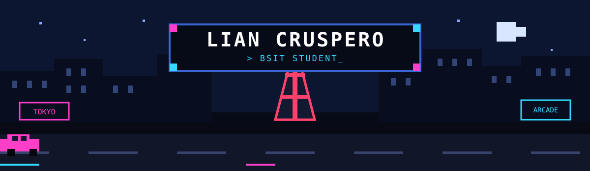

## 👋 About Me

I am a **Bachelor of Science in Information Technology (BSIT) student** with a strong interest in **software development, programming, and emerging technologies**.

I enjoy developing hands-on projects that allow me to apply my knowledge, strengthen my problem-solving skills, and gain practical experience. I am currently building my skills in **C, C++, Arduino, electronics, and embedded systems** while continuously exploring different areas of Information Technology.

### 💻 Tech & Skills

- 🧑‍💻 **Languages:** C • C++
- ⚙️ **Technologies:** Arduino • Electronics • Embedded Systems
- 🤖 **Projects:** MotoBot • Smart Cane • LED Systems • C Applications
- 🧠 **Skills:** Problem Solving • Logical Thinking • Programming Fundamentals
- 🌱 **Currently Learning:** Information Technology • Automation • Embedded Systems

> 🚀 **Build. Experiment. Learn. Repeat.**

---

## 🌐 Portfolio

---

# 💻 Tech Stack

### Programming

### Front-end

### Tools & Technologies

### Currently Learning

  

