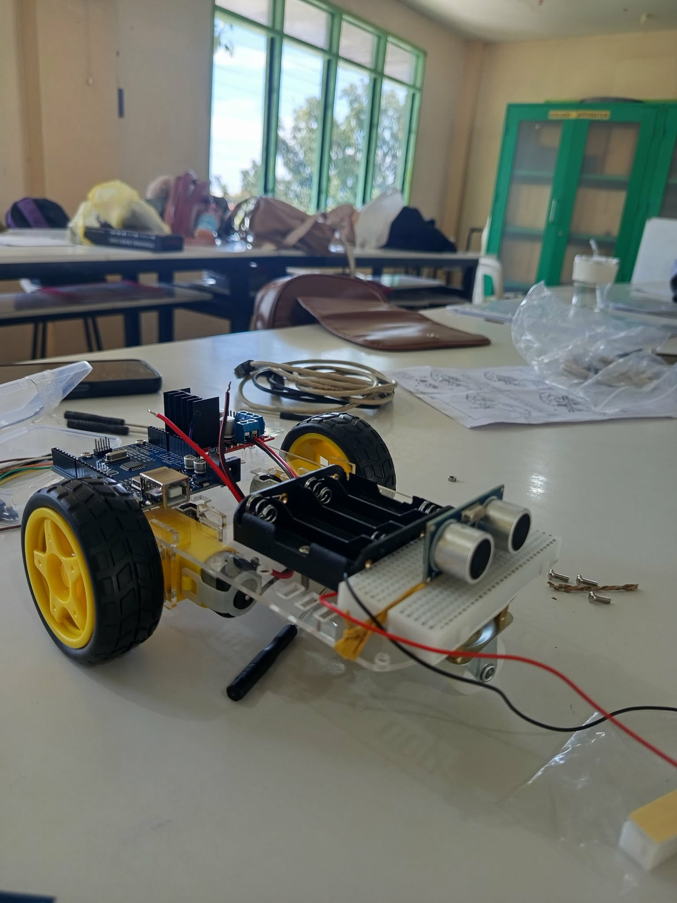

# 💫 About Me:
## 👋 About Me

I'm a **BSIT student who enjoys exploring technology through hands-on projects.**
I believe the best way to learn is by building, experimenting, and solving problems.

💻 **Programming:** C • C++  
🤖 **Projects:** MotoBot • Smart Cane • LED Systems • C Applications  
🔧 **Technologies:** Arduino • Electronics • Embedded Projects  
🧠 **Skills:** Problem Solving • Logical Thinking • Programming Fundamentals  
🌱 **Currently Exploring:** Information Technology • Automation • Embedded Systems  

I enjoy transforming ideas into working projects and continuously
challenging myself to learn something new.

### 🚀 What I'm Working Toward

Building a strong foundation in technology, gaining real-world
experience, and discovering the IT field where I can make the greatest impact.

> **Think → Build → Test → Improve**

---

# 🚀 Featured Projects

## 🤖 MotoBot

A hands-on Arduino robotics project involving motors, electronics, sensors, and hardware integration.

**What I learned:**
- Arduino programming
- Motor control
- Electronics and wiring
- Hardware integration
- Troubleshooting and testing

---

# 💻 Tech Stack:
         
# 📊 GitHub Stats:
 
 

### ✍️ Random Dev Quote

